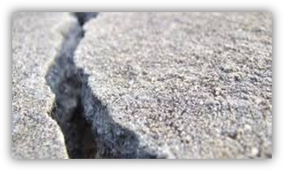
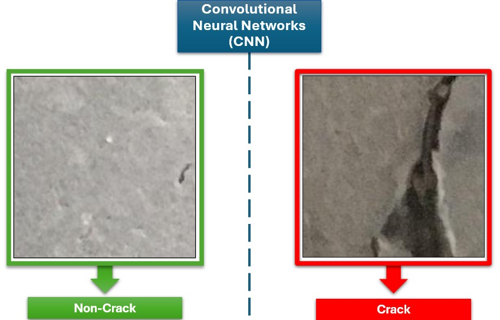
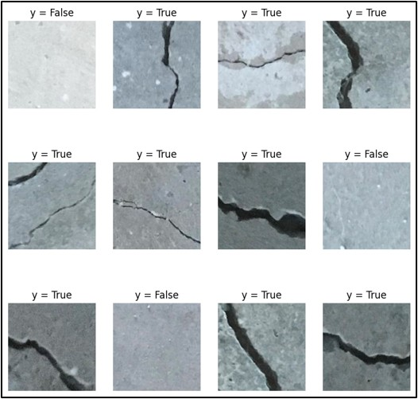
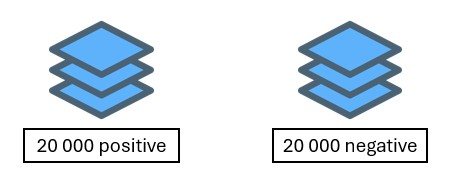
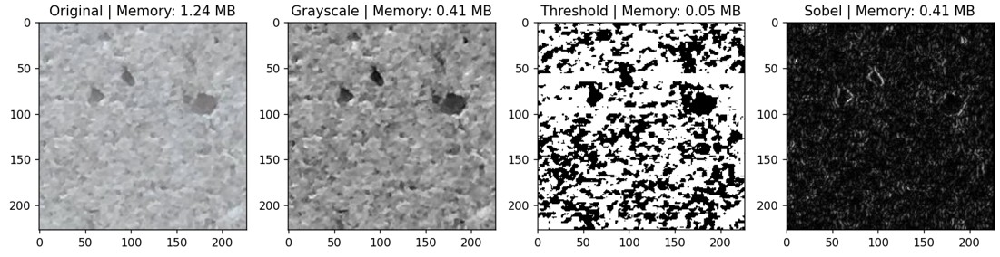
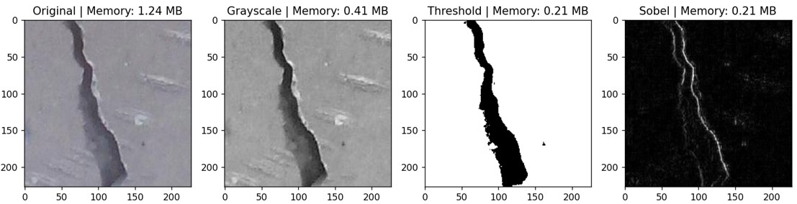
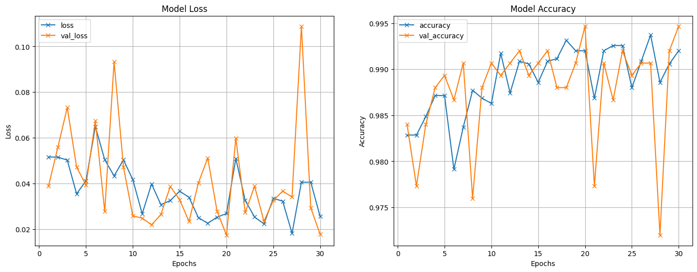

# 📌 Concrete Crack Detection using Convolutional Neural Networks

<p align="center">
  
</p>

## 📖 Description
This project is a machine learning model designed to train a convolutional neural network to classify concrete images, wether a crack is present or not. The model is trained on the Mendeley Data [2] dataset to achieve high accuracy in distinguishing between fractured and non-fractured concrete stuctures.

<p align="center">
  
</p>

## 📁 Project Structure

```txt
/concrete-crack-detection
│── README.md               # Project overview and instructions
│── requirements.txt        # Dependencies
│── notebooks/              # Jupyter notebooks for EDA and model training
│── src/                    # Source code
│   ├── data/               # Data processing scripts
│   ├── models/             # Model definition, training, and evaluation
│   ├── utils/              # Helper functions
│── data/                   # Raw and processed datasets (ignored in Git)
│   ├── raw/                # Data processing scripts
│   ├── processed/          # Feature X and target y
│── models/                 # Saved model files
```

## 🚀 Installation

1. Clone the repository:
```bash
git clone https://github.com/DEVELOPER-DEEVEN/concrete-crack-detection.git
cd concrete-crack-detection
```

2. Create a virtual environment:
```bash
python -m venv venv
source venv/bin/activate  # For Mac/Linux
venv\Scripts\activate  # For Windows
```

3. Install dependencies:

```bash
pip install -r requirements.txt
```

## 🖥 Usage

This repository comes already with the loaded that
1. Download the dataset:
To donwload the data, it is provided by [1] (refference): https://data.mendeley.com/datasets/5y9wdsg2zt/2

  - Run the file located in `src\data\data_loader.py` and specify the amount of images to be donwloaded for each class. With:

  ```bash
  python -m src\data\data_loader.py
  ```

  - Run the `processing_loader.py` to perform image processing on the original images (grayscale, filtering, sobol).


2. run the `src\main.ipynb` to train the model and then saving it.

## 📌 Dataset

<p align="center">
  
</p>


<p align="center">
  
</p>


Source: [[Dataset Name & Link]](https://data.mendeley.com/datasets/5y9wdsg2zt/2)

Preprocessing example:

<p align="center">
  
</p>

<p align="center">
  
</p>


## 📊 Results

<p align="center">
  
</p>


